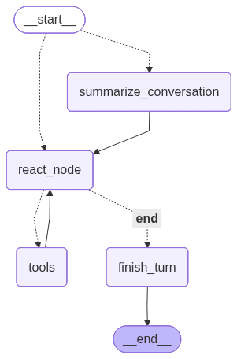

# EDASubagent

基于 LangGraph 构建的对话式 EDA（探索性数据分析）代理，支持对 CSV 数据集进行自然语言交互式分析。

> **注意**：本项目是 [LangChain Academy「Intro to LangGraph」](https://academy.langchain.com/courses/take/intro-to-langgraph/lessons/58238107-course-overview) 课程的学习项目。当前代码主要用于实践 LangGraph 的核心机制——图构建、状态管理和工具调用循环——不追求分析功能的完整性。

---

## 功能概览

加载任意 CSV 文件，即可通过自然语言与代理对话。代理会自动选择合适的分析工具执行查询。

| 能力 | 示例问题 |
|---|---|
| 数据集概览 | "这个数据集有哪些列？有多少缺失值？" |
| 描述性统计 | "age 和 fare 列的均值、标准差是多少？" |
| 分布分析 | "Pclass 列的分布是什么？" |
| 相关性分析 | "age、fare 和 survived 之间的相关性如何？" |
| 多轮追问 | "刚才那几列，再看看它们的分布" |

代理自动维护对话历史，后续追问可以直接引用前文。

---

## 使用方法

### 1. 环境要求

- Python 3.10+
- [DeepSeek API Key](https://platform.deepseek.com/)

### 2. 安装

```bash
git clone <repo-url>
cd EDASubagent
python -m venv .venv
.venv\Scripts\activate        # Windows
# source .venv/bin/activate   # macOS/Linux
pip install -e .
```

### 3. 配置

在项目根目录创建 `.env` 文件：

```env
DEEPSEEK_API_KEY=your_key_here
```

### 4. 运行

```bash
python main.py --file path/to/your/data.csv
```

启动后进入 **Textual 终端界面（TUI，布局 B：双栏 + Agent 行为栏）**：

```
┌──────────────────────────────┬──────────────────────────────┐
│ 对话区                       │ 数据概览（列/类型/缺失/唯一值）│
│  你: age 列的分布            ├──────────────────────────────┤
│  助手: age 右偏，集中 20–40▌ │ 分析结果（工具输出表格）       │
│  （流式叙述文本）            ├──────────────────────────────┤
│                              │ Agent 行为（ReAct 循环实时流水）│
├──────────────────────────────┴──────────────────────────────┤
│ > ▌                                                          │
└─────────────────────────────────────────────────────────────┘
```

- **左栏**：对话区，助手回答逐 token 流式呈现；底部为输入框，回车提交。
- **右栏（三块常驻）**：
  - *数据概览*——加载时填充一次的列结构表；
  - *分析结果*——工具返回的结构化数据，由界面**确定性渲染**为表格（非 LLM 逐字打印）；
  - *Agent 行为*——实时显示 ReAct 循环正在执行的节点与工具调用（如 `tools  get_distribution(column='age')`）。

输入中文或英文问题即可，`Ctrl+Q` 退出。

### 5. 测试

```bash
pip install -e ".[test]"   # 安装测试依赖（如尚未安装）
pytest
```

`tests/` 覆盖图编译与路由（`test_graph.py`）、对外契约（`test_schemas.py`）与分析工具（`test_tools.py`）。

---

## 架构

```
init_session（图外）   ← 探索数据集结构 + 注入系统提示，作为种子写入 checkpoint
  │
  ▼
START
  │  entry_condition：turn 达阈值？
  ├─是─► summarize_conversation（压缩历史）─┐
  │                                          ▼
  └─否─────────────────────────────► react_node ◄────────┐
                                        │                  │
                                        ├─ 需要调用工具？ ─是─► tools（执行分析）
                                        │
                                        └─否─► finish_turn ─► END
```

**关键设计决策：**

- **LangGraph ReAct 循环**：`react_node` ↔ `tools` 循环执行，直到 LLM 判断可以给出最终回答。
- **schema 初始化外置**：数据集结构探索在图外的 `init_session` 完成，经 `update_state` 把种子 state（系统提示 + 结构快照）写入 checkpoint，避免每轮 invoke 重复探索。
- **持久化记忆（MemorySaver）**：`graph` 编译时挂载进程内 checkpointer，按 `thread_id` 隔离/恢复各会话，调用方无需手动持有 `EDAState`。
- **长对话压缩**：累计轮数达 `SUMMARY_TURN_THRESHOLD` 时，`summarize_conversation` 节点摘要并裁剪历史消息（保留最近两轮）。
- **双模式流式**：TUI 通过 `agent.py` 的 `ask_stream_events` 单循环消费 `stream_mode=["updates","messages"]`——`messages` 路把 token 送入对话区，`updates` 路驱动 Agent 行为栏与分析结果表格。
- **契约解耦**：调用方仅依赖 `schemas.py` 的 `EDAInput`/`EDAOutput` 与 `agent.py` 暴露的公共接口，不感知 graph 内部消息结构。
- **工具绑定 LLM**：四个分析工具在配置阶段绑定到 LLM，模型自主选择并调用。

### 分析工具

| 工具 | 输入 | 返回值 |
|---|---|---|
| `explore_schema` | *(无)* | 列名、数据类型、空值数量、唯一值数量、示例值 |
| `get_descriptive_stats` | `columns: list[str]` | 每列：count、null_count、mean、median、std、min、Q1、Q3、max |
| `get_distribution` | `column: str`, `bins: int` | 直方图（数值列）或频率表（分类列） |
| `correlation_analysis` | `columns: list[str]` | 自动按列类型选择方法：Pearson（连续v连续）、Cramér's V（分类v分类）、Eta²（分类v连续） |

---

## 技术栈

| 层级 | 技术 |
|---|---|
| 代理框架 | LangGraph + LangChain |
| LLM | DeepSeek（deepseek-v4-flash / v4-pro） |
| 终端界面 | Textual（双栏 TUI + 流式渲染） |
| 数据处理 | Polars（惰性求值） |
| 配置管理 | python-dotenv |
| 可观测性 | Langfuse（可选 callback） |

---

## 项目结构

```
EDASubagent/
├── main.py               # 入口：解析 --file 并启动 TUI
├── config/
│   └── settings.py       # LLM 工厂、数据集加载器、HITL 开关
├── src/eda/
│   ├── agent.py          # 图定义/编译 + 公共接口（init_session, ask, ask_stream_events…）
│   ├── state.py          # EDAState 状态定义
│   ├── schemas.py        # EDAInput / EDAOutput 对外契约
│   ├── nodes.py          # react_node, summarize_conversation, finish_turn
│   ├── edges.py          # entry_condition / tools_condition 路由
│   ├── prompts.py        # 系统提示与摘要模板
│   └── tools.py          # 四个 EDA 分析工具
└── tui/
    ├── app.py            # Textual TUI 应用（布局 B）
    └── app.tcss          # TUI 样式表
```

---

## 当前Agent图结构



## 已知局限（Demo 范畴）

- **无可视化**：仅文本与表格输出，不含图表功能。
- **仅限 CSV**：不支持 Excel、Parquet 或数据库等格式。
- **HITL 未实现**：human-in-the-loop 由 `config/settings.py` 的 `HITL_ENABLED` 开关控制，当前默认关闭（graph 暂未配置 interrupt）。
- **Agent 行为栏粒度**：trace 为节点级（节点/工具调用），不展开节点内部细分步骤。
